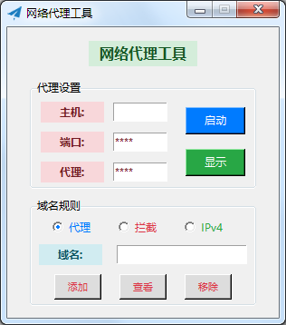
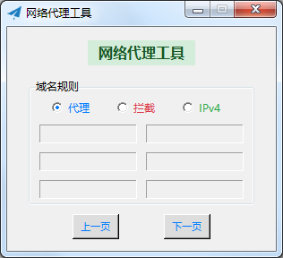

# 代理转发

转发手机网络请求到PC端

## 使用方法

应用场景：PC端能访问网络，局域网内的移动端无法访问网络。通过代理转发，使移动端访问相应资源。

1. PC端运行程序：python start.py
2. 移动端连接WIFI，设置代理地址为IP，端口信息。（代理IP为PC端IPv4地址，端口设置为代理端口，默认为8080）
3. 对于某些特定网络，可以设置代理端口（1080-1084）以访问相应资源

## 设置项

Python版本要求3.7及以上

设置文件位于data目录下，具体说明如下：
1. config.json: 设置代理IP、端口以及Socks端口，默认为PC端全部可用IP，代理端口为8080
2. hostlist.json: Socks代理名单、拦截名单以及IPv4访问名单

## 软件截图

1. 工具主界面

2. 域名规则界面

